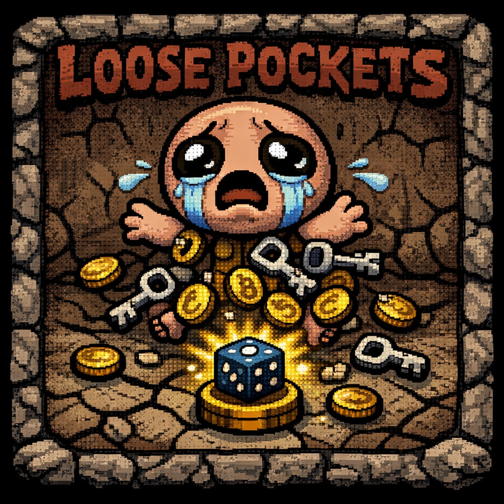

# Loose Pockets

  

  <b>Your build is only as safe as your dodging skills.</b>

---

### 🎬 WATCH THE CHAOS IN ACTION

  
   
  <i>Click the image above to watch the trailer!</i>

---

## 💀 What is this?

**Loose Pockets** introduces a high-stakes "Sonic-style" mechanic to *The Binding of Isaac: Repentance*. When you take damage, you don't just lose health—**you physically drop your passive items onto the floor!**

It transforms every hit into a moment of panic. Do you dive into danger to save your *Sacred Heart*, or let it vanish forever to stay alive?

### ✨ Why players love it:
- **⚠️ The Panic:** Getting hit ejects 1–2 random items from your inventory.
- **💨 The Scramble:** Items are flung away with physics. You have to chase them down!
- **⏳ The Timer:** Dropped items flicker and **vanish after 5 seconds**. If you're too slow, they are gone forever.
- **🛡️ Anti-Softlock:** Critical story items (Polaroid, Negative, Key Pieces) are **Blacklisted** and will never drop.

---

## ⚙️ Configuration (NEW!)

**Now with full [Mod Config Menu](https://steamcommunity.com/sharedfiles/filedetails/?id=2487535818) support!**

You no longer need to edit code. Just open the menu in-game (usually `L` or `F10`) to customize your suffering:

| Setting | Description |
| :--- | :--- |
| **Drop Chance** | Percentage chance to drop an item on hit (0-100%). |
| **Despawn Time** | How long items stay on the floor (1s - 60s). |
| **Max Drops** | Limit how many items spew out at once. |
| **Pickup Delay** | Add a cooldown before you can reclaim items (for extra chaos). |
| **Panic Mode** | *Hardcore:* Dropped items appear as "?" (Blind) sprites. |

*(If you don't have Mod Config Menu installed, the mod runs with balanced default settings).*

---

## 📥 Install

1. **Steam Workshop (Recommended):** Subscribe to the mod on Steam to get automatic updates.
2. **Manual Install:**
   - Download the latest release.
   - Extract the `loose-pockets` folder into your game's `mods` directory.
   - Start the game and enable it in the Mods menu.

---

## 🤝 Support & Contributions

Found a bug? Have a crazy idea?
Open an issue or submit a pull request on [GitHub](https://github.com/alexandrusu1/loose-pockets).

**License**
MIT